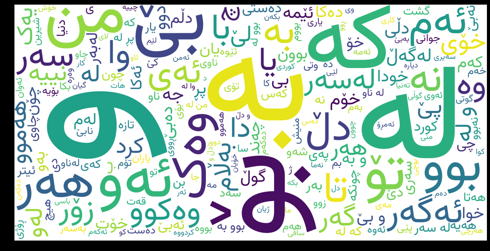
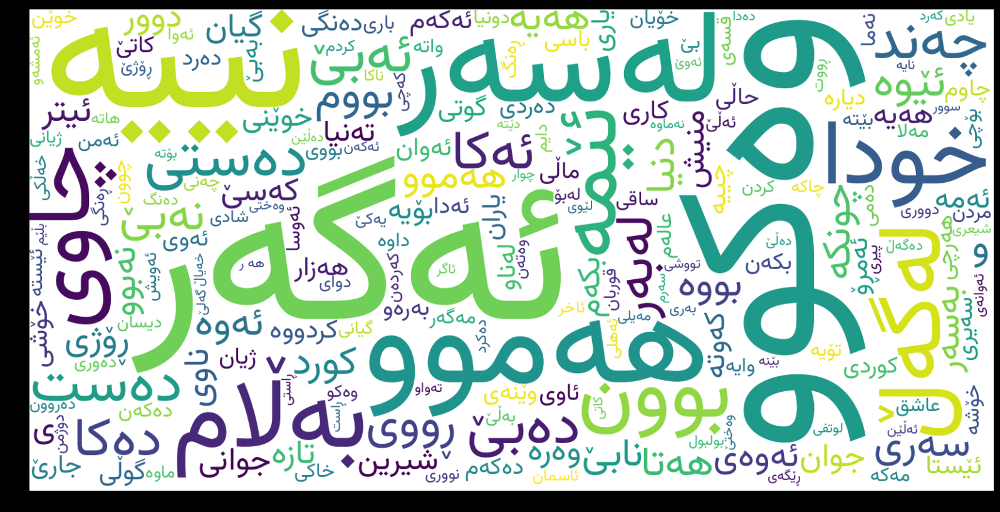
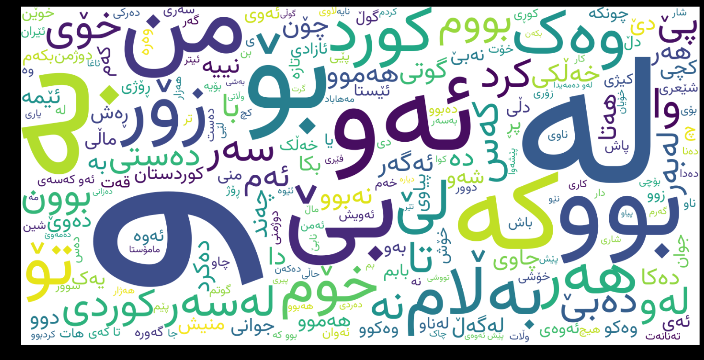
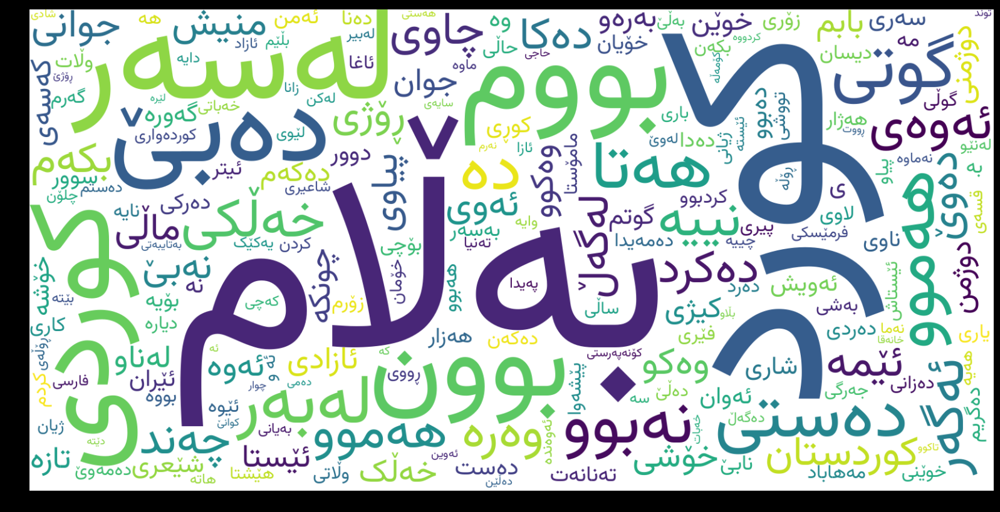

# Kurdish Poems Word-Cloud Project

This project generates word-cloud images for Kurdish poems. It includes 117 poets from the allekok repository and compares the word frequency results for all poems with those of the famous Kurdish poet Mamosta Hemin. 

## Installation

To use this project, follow these steps:

Install the required Python packages:

```bash
pip install -r requirements.txt
```

Below packsges needed to be built for supporting Kurdish language characters perfectly by _matplotlib_ and _wordcloud_ libraries:

```bash
freetype-2.13.0
graphite2-1.3.14
harfbuzz
libraqm
```

Source of the used font _vazirmatn_ in this project:

```bash
https://github.com/rastikerdar/vazirmatn
```

## Usage

To generate word-cloud images, run the following commands:

```python
python read_poems.py && python get_and_generate_wordclouds.py
```

This will clone the allekok-poems from its repository, create word-frequency files in json format, and generate word-cloud images for each poet with their names as directories for the photos and one for each poem separately.

## Result

```python
117 poets
341 directories
10,658 poem files
261,788 lines (after cleaning)
1,849,262 words
10,151,576 characters
```

The top five words used throughout all poems are:

```json
[
    {
        "entry": "و",
        "frequency": 94940
    },
    {
        "entry": "لە",
        "frequency": 47199
    },
    {
        "entry": "بە",
        "frequency": 37435
    },
    {
        "entry": "بۆ",
        "frequency": 20258
    },
    {
        "entry": "کە",
        "frequency": 18956
    }
]
```

To provide an example of the project's functionality, I conducted a comparison between all the poems and only those written by **Mamosta Hemin**. The first 8 lines of the results are displayed in the following screenshot:


### All Poems Word-Cloud
- taking into consideration one-character words



- without considering one to three character words




### Mamosta Hemin's Poems Word-Cloud 
- taking into consideration one-character words



- without considering one to three character words




Additionally, the project includes a JSON file with the word frequency results for all poems.


## Credit

This project uses the allekok repository, which includes 117 Kurdish poets. The word-cloud generation is based on the Python package wordcloud with helping other packges which support Kurdish characters perfectly such as:
* freetype-2.13.0
* graphite2-1.3.14
* harfbuzz
* libraqm
